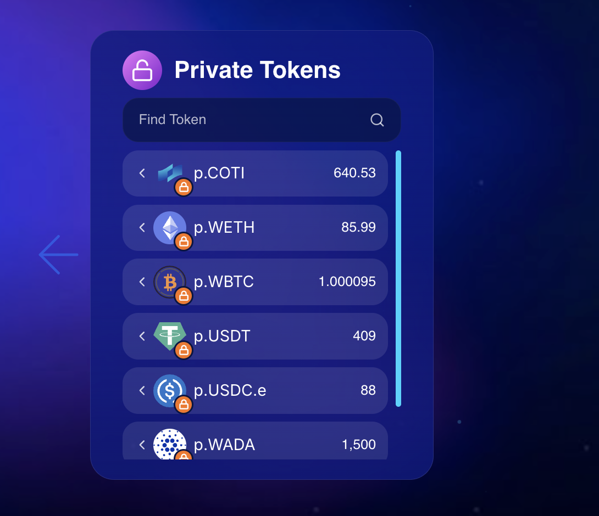

# Convert to Private Tokens

The Privacy Portal allows you to seamlessly mint privacy-preserving equivalents of your public tokens, and subsequently burn them to redeem your public assets. Converting standard public tokens into private tokens requires a two-step approval process:



### Authorize the Conversion&#x20;

If you are depositing ERC20 tokens (not native COTI), you must first approve the Portal to access your tokens:

* Select your desired asset from the Public Tokens list and enter the amount you wish to convert. Click **Approve**.
* Your MetaMask wallet will request a spending cap authorization. Review the estimated network fee and **confirm** the allowance.

<figure><figcaption>
Approve Spending
</figcaption></figure>




### Convert to Private

* After the spending approval is processed on-chain, click the **Portal In** button.
* Confirm the minting transaction in your wallet.
* Your new minted  Private Tokens will appear in the **Private Tokens** dashboard.

<figure><figcaption>
Private Tokens
</figcaption></figure>



