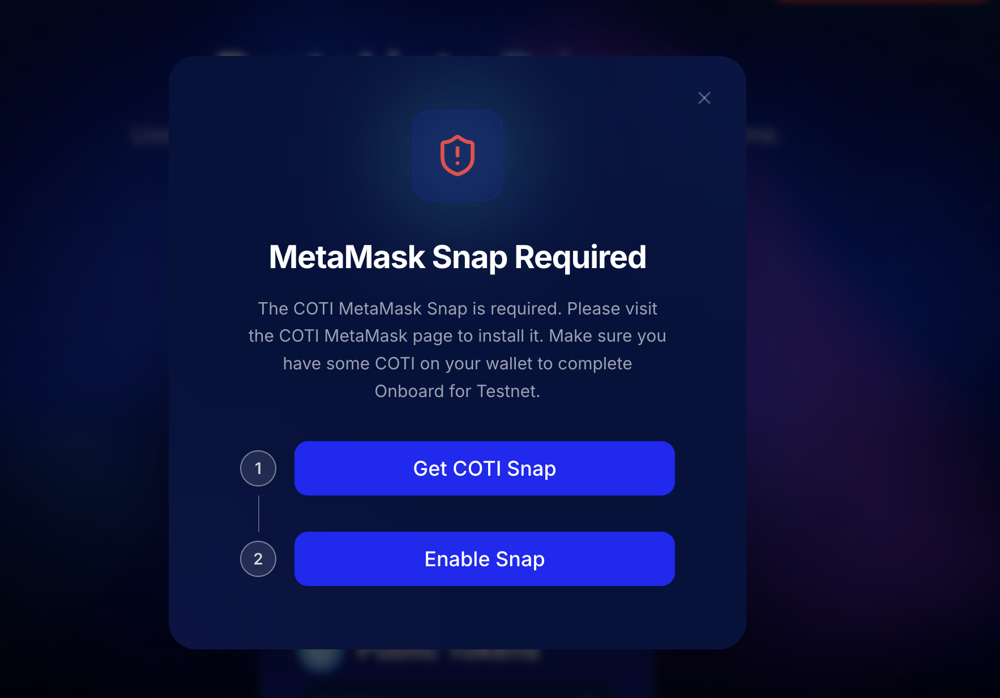

# MetaMask Snap Setup

COTI MetaMask Snap is a plugin that enables you to execute encrypted transactions on the COTI Blockchain Network by granting Snap secure access to your [AES Keys](../../how-coti-works/advanced-topics/aes-keys.md). 

* When you click on the **Unlock** button displayed within the Private Tokens dashboard for the first time, a prompt titled “**MetaMask Snap Required**” will appear. Click the “**Get COTI Snap”** button and follow the  [COTI MetaMask Snap installation](https://dev.metamask.coti.io/) instructions. &#x20;
* Once the installation of COTI Snap is complete, click on the “Enable Snap” button.

<figure><figcaption></figcaption></figure>


&#x20;Ensure your wallet contains native COTI to cover the gas fees required for the Testnet onboarding process. .


