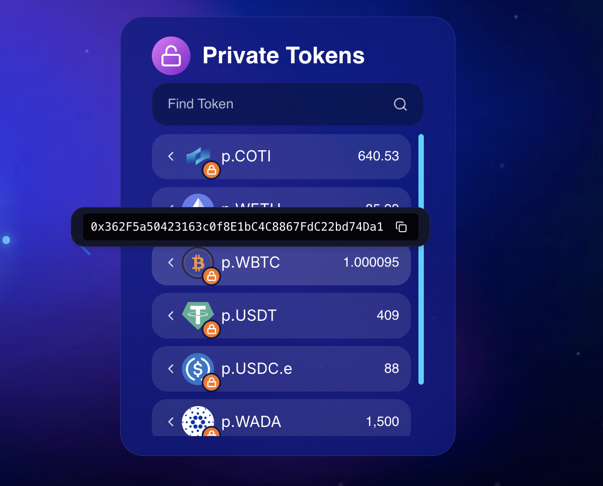
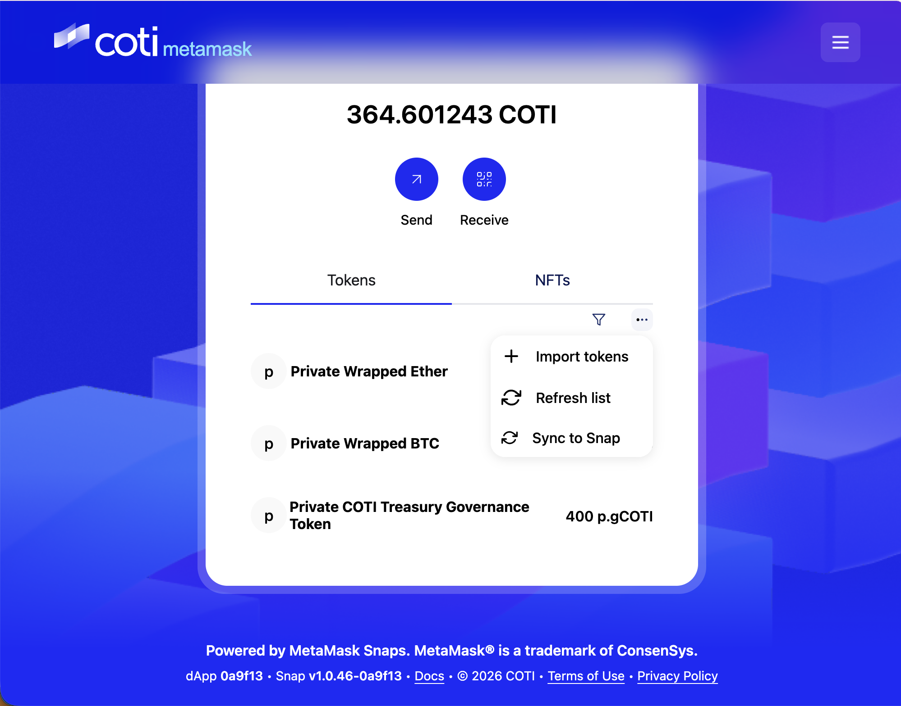

# Private Tokens on MetaMask

You can transfer and view private tokens on the MetaMask Snap page. Here’s how to enable your private tokens on MetaMask Snap. 



### Locate the contract address

Hover over the address of the desired private token (e.g., p.WETH) in the portal's Private Tokens list and click the copy icon.  

<figure><figcaption>
Portal Out
</figcaption></figure>




### Import into COTI Snap

\
To add your private token balances to MetaMask: 

* Navigate to the  [COTI Metamask wallet page](https://metamask.coti.io/wallet)
* Click the menu icon (...) and select **Import Token**.&#x20;
* Copy the **Contract Address** from the Private Tokens list in the Portal (via the copy icon).
* Paste the copied contract address to sync the token to your local Snap.

<figure><figcaption>
COTI Snap Metamask
</figcaption></figure>



