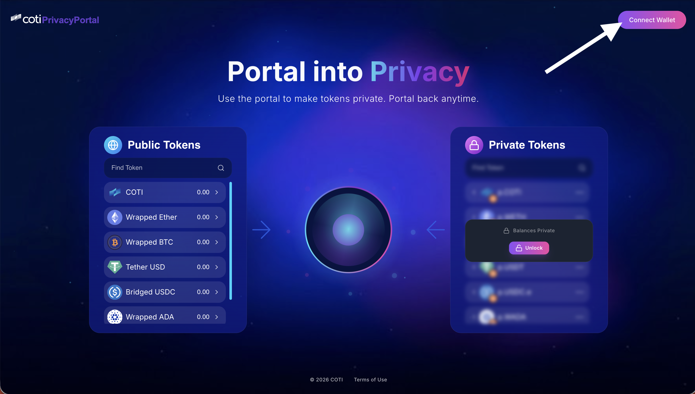

# Setup Portal Account

While managing public assets is straightforward, the true power of the COTI Privacy Portal lies in its ability to conceal financial data. To interact with confidential assets, you must configure your Privacy Portal account to handle advanced decryption processes securely. Start by:



### Connecting Your Wallet

* Open the [COTI Privacy Portal](https://privacy.coti.io/) (production) or [dev Privacy Portal](https://dev.privacy.coti.io/) (testnet/staging) in a secure browser. Make sure you completed the [Prerequisites](prerequisites.md) and have the MetaMask extension installed.
* Click **Connect Wallet** in the top-left area of the portal. MetaMask will ask you to authorize the connection. Review the request and approve it.\
     

    <figure><figcaption>
Public Tokens Balances
</figcaption></figure>

     



### Check Your Tokens Public Balance

Once your wallet is connected, open the **Public Tokens** dashboard. It shows **public** asset balances (e.g., COTI, WETH, USDT) on the COTI network. To bridge assets onto COTI, see the [COTI Bridge documentation](../../coti-bridge/).\
\
Before proceeding, please verify that your assets public balances accurately reflect your on-chain holdings, as this confirms that your wallet is communicating flawlessly with COTI Privacy Portal. 

<figure><figcaption>
Public Tokens Balances
</figcaption></figure>


💡 **Tip:** Use the search bar to quickly find a specific token.




### Unlock your private tokens​

Please focus on the Private Tokens section of the portal interface. By default, this section is locked, and your balances are encrypted and hidden from view. To unlock them, follow the steps below.\
\
1\. Click the **Unlock** button on the **Private Tokens** dashboard.&#x20;

<figure><figcaption>
Unlock button
</figcaption></figure>


If this is your first time using the Privacy Portal, it will prompt you to install the official COTI MetaMask Snap. This extension handles encryption and decryption of your private balances. [Follow the instructions here](metamask-snap-setup.md).


2.  After clicking the unlock button, a modal screen will appear, requesting authorization to access your [COTI AES security key.](../../how-coti-works/advanced-topics/aes-keys.md) Please review and authorize the request on the MetaMask snap. 

    <figure><figcaption>
Private Balances
</figcaption></figure>

     
3. &#x20;Once unlocked, your decrypted private balances will be displayed. To aid in visual differentiation, COTI Privacy Portal utilizes a specific nomenclature system. You will observe that your decrypted assets carry a distinct prefix —such as p.COTI, p.WETH, or p.USDC.e— clearly distinguishing them from their transparent counterparts in the **Public Tokens** dashboard.

<figure><figcaption>
Private Balances
</figcaption></figure>


🔒 **Privacy Note:** The Private Token balances are encrypted on the blockchain. They are decrypted locally in your browser using your personal AES key stored in the COTI Snap. No one else can see your balances.




