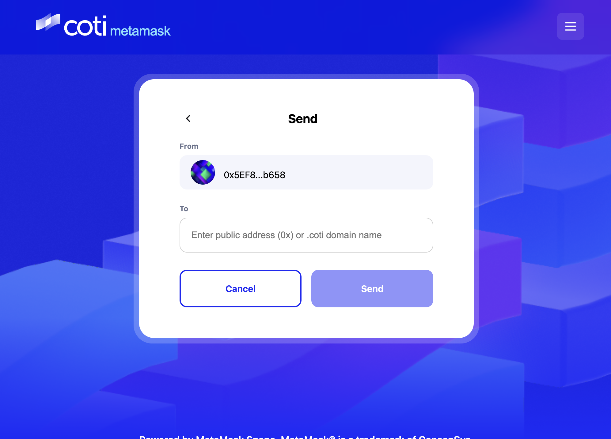

# Transfer Private Tokens

You can send private tokens directly to other users within the COTI ecosystem. To transfer private tokens using the COTI Wallet on MetaMask:

1. Open the COTI Wallet on MetaMask: [dev.metamask.coti.io/wallet](https://dev.metamask.coti.io/wallet) (testnet) or [metamask.coti.io/wallet](https://metamask.coti.io/wallet) (mainnet).
2. Select the private token you'd like to send.
3. Click the "Send" button.
4. Enter the recipient's address on the next screen.
5. Approve the transaction permissions on MetaMask as required.

<figure><figcaption>
COTI Snap Metamask
</figcaption></figure>


Recipient Note: The receiver will find the tokens in their own MetaMask Snap after they have completed their onboarding and imported the token address.

