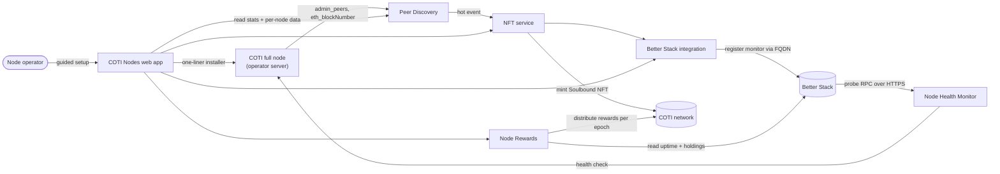

# Node Ecosystem

The **COTI Node Ecosystem** is the product surface that lets anyone run, monitor, and earn rewards from a COTI full node. It is composed of:

* a web app that guides operators from zero to a live, reward-eligible node (see [Networks](./#networks) below for the URLs),
* an automated installer that stands up a COTI full node on Ubuntu 24.04 LTS in a single command,
* a set of backend services that discover peers, mint node NFTs, monitor uptime, and distribute rewards each epoch.

This section documents the product — what it does, how to install a node through it, how its UI is organized, and the terminology you will encounter along the way.

## Networks

The ecosystem runs on two networks. All guidance in this section applies to both unless noted; look up the right URL or value in the table below.

|                                 | **Testnet**                                              | **Mainnet**                              |
| ------------------------------- | -------------------------------------------------------- | ---------------------------------------- |
| Web app                         | [dev.nodes.coti.io](https://dev.nodes.coti.io)           | [nodes.coti.io](https://nodes.coti.io)   |
| Status page (public, hot nodes) | [testnet.uptime.coti.io](https://testnet.uptime.coti.io) | [uptime.coti.io](https://uptime.coti.io) |
| Recommended node disk space     | ≥ 100 GB                                                 | ≥ 700 GB                                 |
| Installer host                  | `fullnode.testnet.coti.io`                               | `fullnode.mainnet.coti.io`               |

The **status page** is the public [Better Stack](https://betterstack.com/) dashboard where every hot node's monitor is visible. It is the fastest way to eyeball the current health of the whole fleet.


If you are looking for the protocol-level **Running a COTI Node** guide (hardware specs, manual Docker flow, ports, FAQ), see [**Running a COTI Node**](../running-a-coti-node/). The current section focuses on the managed, UI-driven experience and the ecosystem that surrounds it.


## What the COTI Node Ecosystem gives you

* **One-command install** of a COTI full node on a certified OS (Ubuntu 24.04 LTS) with HTTPS and a proxy already configured.
* **Live visibility** into the node fleet — Who is online, which nodes are hot, how many earned rewards this epoch.
* **Per-operator dashboard** for your own node(s): thermal state, uptime, latency, rewards history, eligibility.
* **Automatic monitoring registration** in Better Stack once your node is recognized by the network.
* **Rewards distribution** every epoch to operators who meet the eligibility rules (holdings + uptime).

## High-level architecture


**A valid DNS (FQDN) is required to earn rewards.** The ecosystem measures your node's uptime by reaching its JSON-RPC endpoint through the domain name you configure. A node without a reachable DNS can still sync the chain, but it will **not** be credited with uptime and therefore will **not** receive rewards. See [installation.md](installation.md) for DNS prerequisites.


## Where to go next

* [**Features**](features.md) — everything the product does, end-to-end.
* [**Installation**](installation.md) — what the automated installer does on your server, and the DNS/server requirements.
* [**UI guide**](ui-guide.md) — a page-by-page tour of the web app, with focus on the spin-up flow and the warm-up period.
* [**Backend services**](backend-services.md) — the five services behind the ecosystem, described from an operator's perspective.
* [**Glossary**](glossary.md) — thermal states, NFT states, warm-up windows, eligibility, and other terms you will see in the UI.
