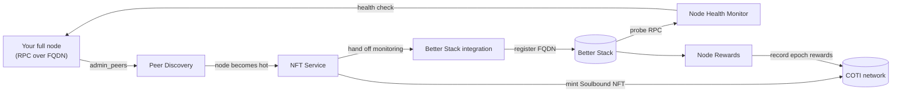

# Backend Services

The ecosystem is powered by five cooperating backend services. Operators do not interact with them directly — the web app (see [Networks](./#networks) for URLs) is the only interface. This page describes each service from the operator's perspective: **what it does for you** and **what its outputs look like in the UI**.

## Peer Discovery Service

**What it does for you**

Peer Discovery is the service that first _sees_ your node. It repeatedly calls `admin_peers` on a set of reference nodes and records which peers are currently connected. As soon as your node shows up in those responses, it is considered **online** in the ecosystem.

Peer Discovery is also responsible for the **thermal state machine**:

* While your node is newly online, it is **cold** with the NFT not yet minted — it is **warming up**.
* Once it has been continuously present for enough time (`HOT_THRESHOLD_HOURS` out of a rolling `HOT_WINDOW_HOURS` window), it transitions to **hot** and triggers NFT minting.
* If a hot node goes offline long enough (`COLD_THRESHOLD_HOURS` out of a `COLD_WINDOW_HOURS` window), it **cools down** back to cold and must warm up again.

**Where it shows up in the UI**

* The home-page **Live node heartbeats** counter.
* The **Nodes** table's **Status** column (active / syncing / offline).
* The **Warmup In Progress** card on `/my-nodes` during the warm-up period.
* The **Thermal** state badge (warming up / hot / cooling down / cold) on internal views.

## NFT Service

**What it does for you**

The NFT service receives the "this node is hot" event from Peer Discovery and mints a **Soulbound Node NFT** to the operator's wallet. The NFT is the on-chain proof that the node exists, who owns it, and what its name and image are.

Because the NFT is soulbound, it cannot be transferred — it is bound to the wallet that set up the node. If an operator regenerates keys, a new NFT is minted to the new wallet; the old one is not reused.

**Where it shows up in the UI**

* The node name and avatar shown everywhere the node appears (dashboard, nodes table, node-details modal).
* The **Edit Node** flow (`/edit-node`) where you update **NFT metadata** — node name, image URI, and optional more-info URL — all stored on-chain on the Soulbound NFT.
* The "No Node Detected" / "Warmup Complete" states on `/my-nodes`, which depend on whether the NFT exists for the connected wallet.

## Better Stack Integration Service

**What it does for you**

Once your node has an NFT, the Better Stack integration service automatically registers your node's `https://<your-fqdn>/rpc` URL with [Better Stack](https://betterstack.com/) as a monitored endpoint. From that point on, Better Stack polls your node on a regular cadence and records the results.

The operator does not configure or pay for Better Stack — the ecosystem manages the monitor centrally.

**Where it shows up in the UI**

* The **all-time uptime percentage** displayed for your node in the dashboard and nodes table.
* A public **status page** that aggregates every hot node's monitor state (up / down). The URL is listed in [Networks](./#networks).


Because monitoring happens over HTTPS against your public RPC hostname, a node without valid DNS / routing cannot be monitored — see [**Installation**](installation.md) ([**Own domain**](installation-own-domain.md), [**Wizard tunnel**](installation-wizard-tunnel.md)) and the [Glossary](ui-guide/glossary.md) FQDN entry.


## Node Health Monitor

**What it does for you**

The Node Health Monitor is the health-check target that Better Stack calls. When Better Stack asks "is this node healthy?", the Node Health Monitor runs a **multi-signal health check** against the node's JSON-RPC through its FQDN and returns a single **healthy / failing** verdict.

The check is designed so that simply answering RPC calls is **not** sufficient — the service confirms that the node is actually operating, not just reachable. Only healthy results accrue uptime; failures are recorded with a reason so operators can diagnose issues.

**Where it shows up in the UI**

* As the underlying cause of your **uptime percentage** each epoch.
* As the difference between "your node is reachable" and "your node is actually operating" — a reachable-but-unhealthy node does not count as up.

## Node Rewards Service

**What it does for you**

At the end of each **103-hour epoch**, the rewards service:

1. Snapshots each node operator's USDC and COTI holdings.
2. Reads each node's uptime for the epoch from the monitoring platform.
3. Applies the eligibility rules: **uptime is mandatory** on every path, and the operator must satisfy **Path 1** (USDC and COTI each ≥ combo thresholds, plus uptime) **or** **Path 2** (COTI ≥ solo threshold, plus uptime), with whitelist overrides for specific operators.
4. Allocates each eligible node its share of the epoch's reward pool in the on-chain **rewards smart contract**.
5. Records the per-epoch result: earned amount, snapshot values, uptime %, eligibility.

Rewards are **not** pushed to the operator's wallet automatically. Once the contract is credited, the operator claims the accrued balance via the **Claim Now** button on the **My Node** dashboard, or by calling the rewards smart contract directly from any wallet they control.

**Where it shows up in the UI**

* The home-page **Reward-eligible nodes (last epoch)** and **COTI dropped (last epoch)** cards.
* The **Total COTI earned** card (cumulative).
* The **Total Rewards** column in the nodes table.
* The **Total Earned** and **Claim Now** controls in the My Node node-identity card.
* The **Rewards History** table on `/my-nodes`, including USDC, COTI, earned, uptime %, and Eligible / Ineligible per epoch.

## How they work together

For a newly-installed node, the lifecycle is:

1. **Install finishes** → node comes up at `https://<fqdn>/rpc`.
2. **Peer Discovery** sees the node in `admin_peers` responses and starts tracking presence.
3. **Warm-up period** — the UI shows a progress bar until `HOT_THRESHOLD_HOURS` of presence is reached.
4. **Peer Discovery** declares the node **hot** → **NFT Service** mints the Soulbound NFT.
5. **Better Stack Integration** registers the node's FQDN with **Better Stack**.
6. **Better Stack** starts calling the **Node Health Monitor**, which runs the health check against the node's RPC through the FQDN.
7. At epoch boundaries, **Node Rewards** reads uptime + holdings and credits eligible nodes in the rewards smart contract; the operator claims from the **My Node** dashboard or directly from the contract.

The operator only ever touches the web app and their own server — the five services coordinate everything in between.
