# UI Guide

A page-by-page walkthrough of the COTI Nodes web app (see [Networks](../#networks) for the testnet and mainnet URLs). Read [features.md](../features.md) first for the product-level overview; this page describes what each screen shows and how to use it.

## Site map

The top-level navigation exposes three tabs: **Overview**, **My Node**, and **Eligibility**. The spin-up and edit flows are reachable from links inside those pages rather than from the top nav.

| Route          | Tab / Surface           | Purpose                                                         |
| -------------- | ----------------------- | --------------------------------------------------------------- |
| `/`            | Overview                | Public dashboard: live heartbeats, ecosystem stats, nodes table |
| `/join`        | (from "Spin up a Node") | Choose between local install and hosted provider                |
| `/setup`       | (from Join)             | 7-step guided installation wizard                               |
| `/my-nodes`    | My Node                 | Per-operator dashboard (wallet-gated)                           |
| `/edit-node`   | (from My Node)          | Rename your node (stored on the NFT)                            |
| `/eligibility` | Eligibility             | Node reward eligibility: two paths (USDC + COTI vs COTI-only) + notes |
| `/terms`       | (footer)                | Terms of service                                                |

## Overview (`/`)

The landing page has several sections.

<figure>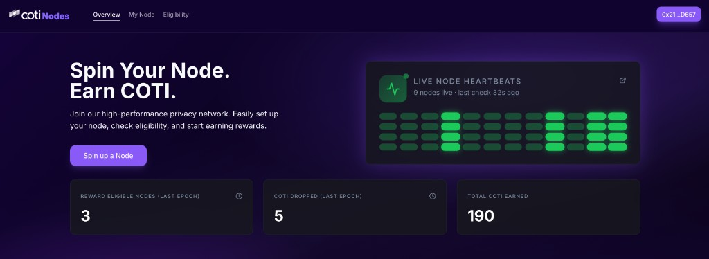<figcaption><p>Overview hero, Live Node Heartbeats, and ecosystem stats.</p></figcaption></figure>

### Hero + live heartbeats

A **"Spin up a Node"** CTA sits alongside the **Live Node Heartbeats** panel. The panel shows:

* The current count of nodes observed by the peer-discovery service.
* How many seconds have passed since the last refresh.
* A purely decorative pulse visualization.

### Ecosystem stats

Three cards summarize the most recent closed epoch and all-time totals:

* **Reward-eligible nodes (last epoch)** — how many nodes met the rules last epoch.
* **COTI dropped (last epoch)** — total rewards distributed last epoch.
* **Total COTI earned** — cumulative rewards paid across all epochs.

Clicking the clock icons on the first two cards opens an **Epoch Status** modal with the current epoch number and time remaining.

### Nodes table

<figure>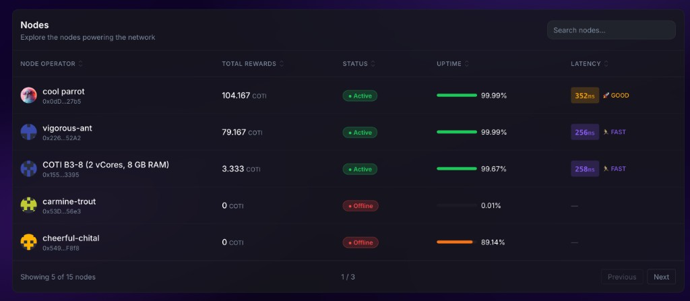<figcaption><p>Every node the ecosystem knows about, sortable and searchable.</p></figcaption></figure>

Columns:

* **Node operator** — NFT avatar, node name, and the truncated node address. Nodes without a minted NFT show "NFT Not Found".
* **Total rewards** — cumulative COTI earned.
* **Status** — Active / Syncing / Offline (see [Glossary → Node status](glossary.md#node-status)).
* **Uptime** — all-time percentage and a proportional bar.
* **Latency** — most-recent RPC latency with a color-coded rank (Fast / Good / Slow).

The search box filters on node name, node address, and status. Clicking a row opens a **Node Details** modal with the node's NFT metadata, rewards breakdown, and a link to the operator's recent activity.

## Join COTI Nodes (`/join`)

<figure>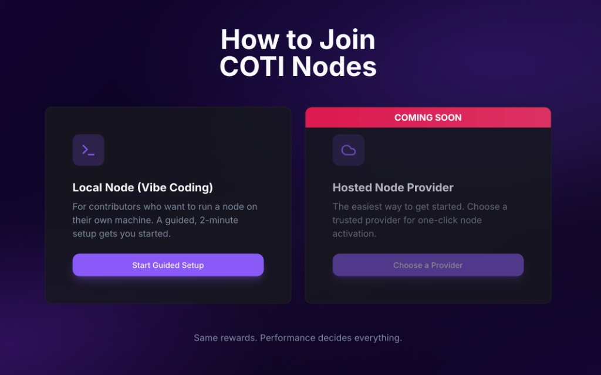<figcaption><p>Entry point for new operators.</p></figcaption></figure>

Two cards:

* **Local node (Vibe Coding)** — routes to `/setup`, the guided installer. This is the primary, fully-supported path.
* **Hosted node provider** — currently labeled **Coming Soon**. Reserved for a future marketplace of third-party providers and not usable yet.

## Spin up a Node (`/setup`)

The installation wizard is a 7-step flow. The header shows **Spin COTI Node** and a horizontal **SetupBar** with short step labels — **Watch Video**, **Terms of Use**, **Generate Keys**, **Setup FQDN**, **Run Command**, **Monitor Node**, **Node Live** — aligned with the sections below. The main panel swaps content per step. The primary **Next** button advances; **Back** goes to the previous step.

### Step 1 — Watch the setup video

<figure>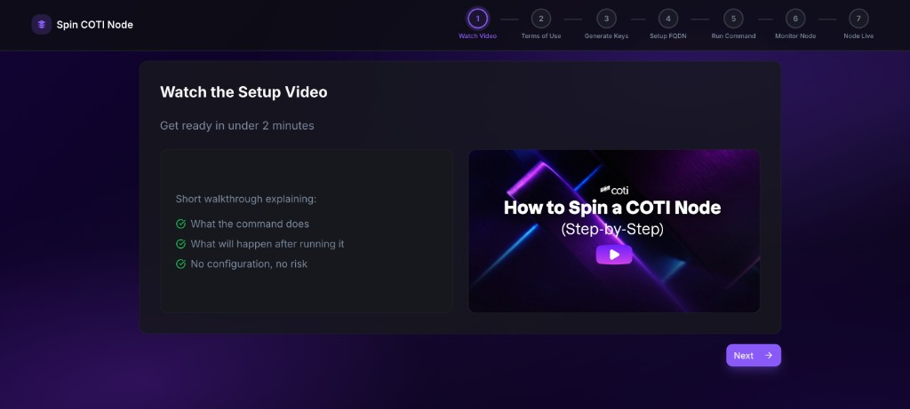<figcaption><p>Step 1: short video walkthrough.</p></figcaption></figure>

A short video plus a bulleted summary: what the command does, what happens after, and that there is no configuration required.

### Step 2 — Accept the terms

<figure>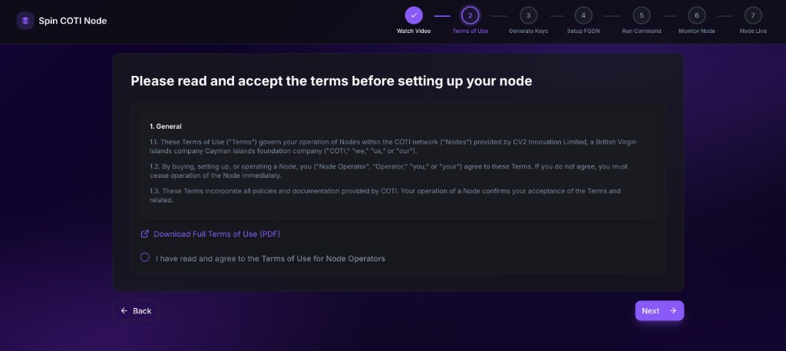<figcaption><p>Step 2: terms of use for node operators.</p></figcaption></figure>

The Terms of Use must be checked before the wizard advances. A **Download Full Terms of Use (PDF)** link exposes the complete document. Trying to continue without checking the box surfaces an inline error.

### Step 3 — Generate node keys

<figure>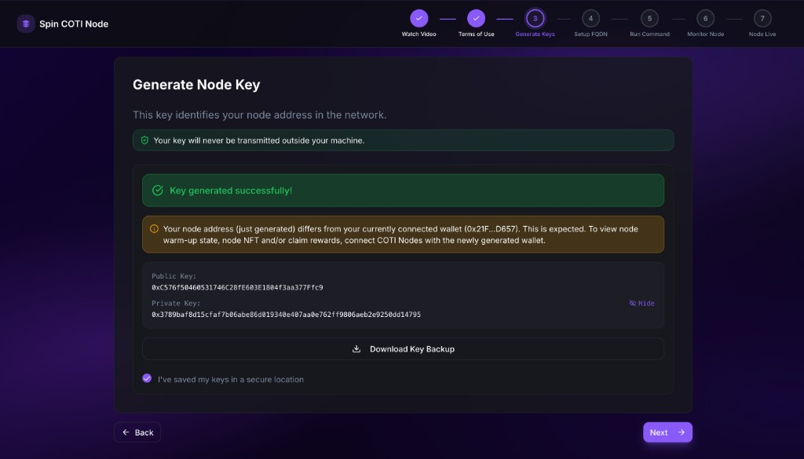<figcaption><p>Step 3: locally-generated node keys with an option to bring your own.</p></figcaption></figure>

Two paths:

* **Generate node keys locally** — the wizard generates a fresh private key in the browser, derives the node address, and offers a **Download Key Backup** button. You must tick **"I've saved my keys in a secure location"** to proceed.
* **Bring your own key** — paste an existing 64-hex private key. The wizard derives the address and confirms it. If that address already owns a node NFT, a modal offers to clear the field so you don't accidentally re-run setup for an existing node.

If the just-generated address differs from the currently connected wallet, a yellow notice explains that you will need to connect the new wallet later to see the node's warm-up state, NFT, and rewards.


The private key is the identity of your node and the wallet that will receive the Soulbound NFT and rewards. It is generated locally and never transmitted. Back it up before continuing.


### Step 4 — Setup FQDN

<figure>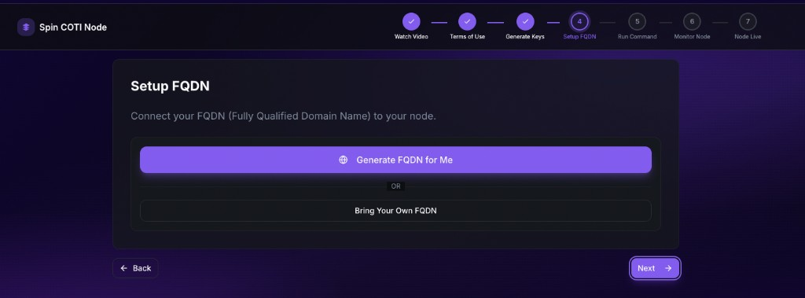<figcaption><p>Step 4: choose a COTI-generated hostname or bring your own FQDN.</p></figcaption></figure>

The panel title is **Setup FQDN**, with the line **Connect your FQDN (Fully Qualified Domain Name) to your node.** You pick how the public hostname is supplied:

* **Generate FQDN for Me** — the default path for the **COTI-managed hostname** (tunnel / **`--with-frp`** install). You do not create DNS at your registrar; the one-liner and edge routing are described in [**Wizard tunnel**](../installation-wizard-tunnel.md). When you click it, the wizard allocates the name and updates the same step: a green **FQDN generated successfully!** banner appears, and a read-only **Node FQDN** field shows the assigned hostname (for example a `*.fullnode.<network>.coti.network`-style name on testnet — the exact zone depends on the environment).

<figure>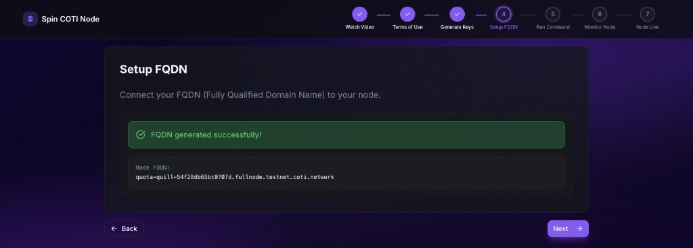<figcaption><p>After <strong>Generate FQDN for Me</strong>: success confirmation and the assigned hostname before <strong>Next</strong>.</p></figcaption></figure>

* **Bring your own FQDN** — for a hostname **you** control. The wizard shows a **Node FQDN** text field (label includes an example such as `node.yourdomain.com`, placeholder **Enter your FQDN.**). An **Important** callout reminds you to configure an **A or CNAME** record at your DNS provider pointing to your server’s public IP **before** you continue, so the name is reachable on the network. Tick **"I have completed my FQDN settings"** (with the line *I verify that my FQDN points to my node's IP.*) to run a live DNS lookup via `dns.google.com/resolve`:

  * Success — you can proceed with **Next**.
  * Failure — an inline error explains that the domain did not resolve; fix the record at your registrar and retry.

  **← Back to Generation.** returns to the choice screen if you want **Generate FQDN for Me** instead. This path matches **Nginx + TLS** on your server — see [**Own domain (Nginx + TLS)**](../installation-own-domain.md).

<figure>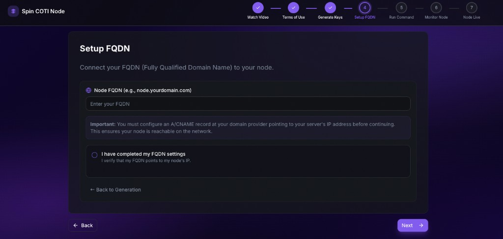<figcaption><p><strong>Bring your own FQDN</strong>: enter your hostname, confirm DNS, or go back to the generated-FQDN path.</p></figcaption></figure>


**This FQDN is the address the ecosystem will use to reach your node's JSON-RPC for uptime monitoring.** **Own domain + Nginx** needs a live DNS record to your server and reachable **80/443**. **COTI tunnel** (`--with-frp`) uses the COTI-assigned hostname and edge TLS. Overview: [**Installation**](../installation.md). Without a reachable public RPC name your node cannot earn rewards.


### Step 5 — Run the command

<figure>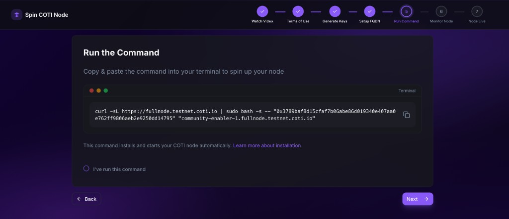<figcaption><p>Step 5: the installer command tailored to your key and FQDN.</p></figcaption></figure>

The wizard displays the one-liner tailored to the key and FQDN from the previous steps:

```bash
curl -sL https://fullnode.<network>.coti.io | sudo bash -s -- "<PRIVATE_KEY>" "<FQDN>"
```

Copy and run it as root on your server. A **"Learn more about installation"** link opens the [**Installation** overview](../installation.md). Tick **"I've run this command"** to advance.

### Step 6 — Waiting for node connection

<figure>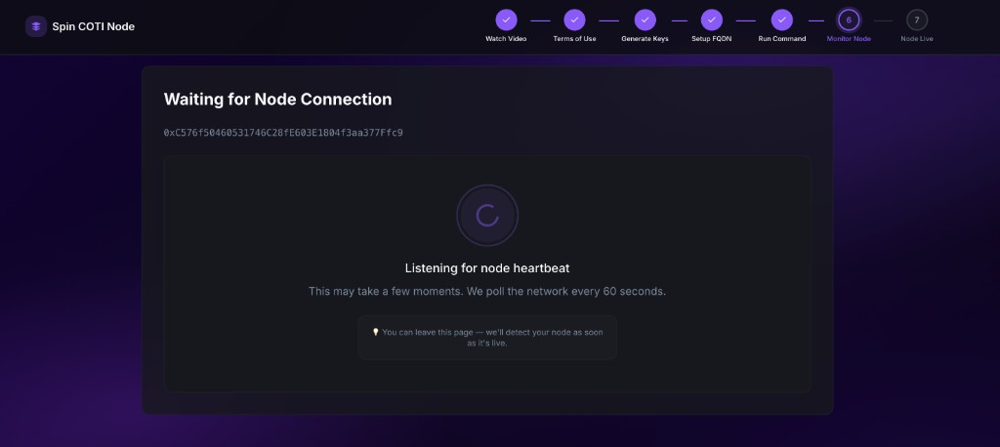<figcaption><p>Step 6: the wizard polls peer discovery every ~60 seconds and advances automatically once your node is seen.</p></figcaption></figure>

The wizard polls the peer-discovery service every \~60 seconds and waits for your node address to show up in the peer set. Three states:

* **Searching** — spinner + "Listening for node heartbeat". You can safely close the tab and return later.
* **Detected** — green check + "Heartbeat Detected!". The wizard auto-advances in a few seconds.
* **Timeout** — after the initial grace period, a retry countdown appears and the wizard retries automatically.


This step only confirms that peers can _see_ your node. It does not mean your node is hot or that an NFT has been minted. That is the **warm-up period** (see [Glossary → Warming up](glossary.md#warming-up)), tracked on the **My Node** tab.


### Step 7 — Your node is live

<figure>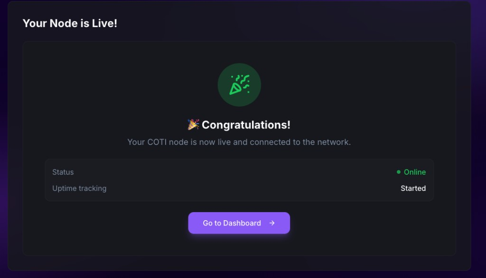<figcaption><p>Step 7: node is on the network and uptime tracking has started.</p></figcaption></figure>

A success card with a **Go to Dashboard** button that routes to **My Node**. It also confirms that uptime tracking has started — the node has been registered with the monitoring stack via its FQDN.

If the connected wallet differs from the node address, the wizard shows a warning explaining that the dashboard only lists nodes owned by the connected wallet — connect the node wallet (or import its private key into MetaMask) to see the node on the dashboard.

## My Node (`/my-nodes`)

The per-operator dashboard. It requires a connected wallet; the wallet must own a Soulbound Node NFT to show full content.

### Warmup (in progress / complete)

<figure>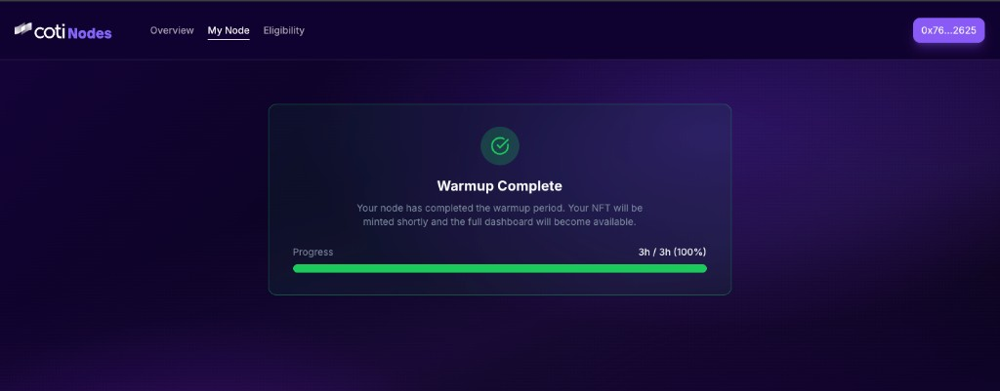<figcaption><p>The warm-up card near the end of the warm-up period, with the progress bar full. The NFT is about to be minted.</p></figcaption></figure>

While the node is warming up, the page shows a **Warmup In Progress** card with an elapsed / required progress bar (for example `18h 30m / 72h (26%)`) and copy explaining that the operator should keep the node online to complete the warm-up.

When the threshold is reached (progress reaches 100%, as in the screenshot above), the card flips to **Warmup Complete**. The Soulbound NFT is minted shortly thereafter and the full dashboard replaces the warm-up card automatically.

### No node detected

<figure>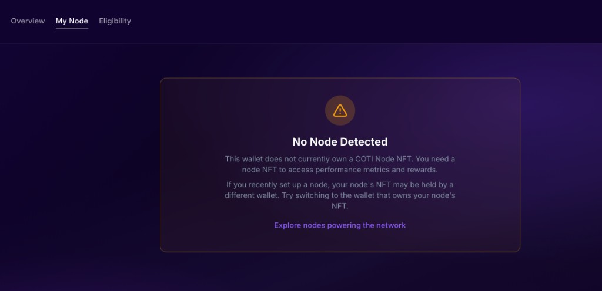<figcaption><p>Empty state for wallets that do not own a node NFT.</p></figcaption></figure>

If the connected wallet has not started setup and does not own a node NFT, the page shows a "No Node Detected" card with a link back to the overview. Operators who just finished `/setup` but see this screen are likely connected with the wrong wallet — the NFT is minted to the **node address**, not the wallet used to navigate the site.

### Full dashboard

<figure>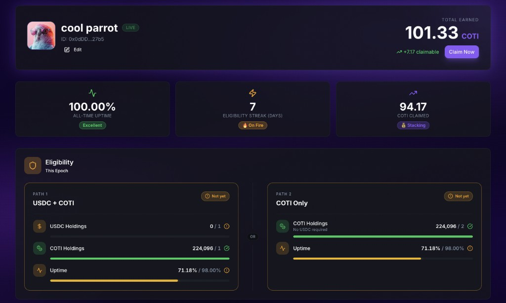<figcaption><p>Full operator dashboard once the NFT has been minted.</p></figcaption></figure>

Once the NFT exists, the dashboard shows:

* **Node identity card** — NFT image, node name, `LIVE` badge, node ID (address), **Edit** button → `/edit-node`, and the headline **Total Earned** in COTI with a **Claim Now** button that withdraws the accrued balance from the rewards smart contract into the connected wallet. Operators who prefer to claim from outside the UI can also call the rewards contract directly.
* **At-a-glance stats** — **All-Time Uptime** with a performance badge (for example _Excellent_), **Eligibility Streak (Days)**, and **COTI Claimed**.
* **Eligibility panel** — two side-by-side **paths** for the current epoch (same structure as **`/eligibility`**): **Path 1 — USDC + COTI** (USDC, COTI, and uptime bars) and **Path 2 — COTI only** (higher COTI bar and uptime). You qualify when **either** path is fully met. Each requirement shows current value vs threshold; cards show met / unmet while loading resolves.
* **Past Epochs table** — paginated per-epoch history with columns:
  * **Epoch** — epoch number.
  * **USDC** — USDC balance at the epoch snapshot.
  * **COTI** — COTI balance at the epoch snapshot.
  * **Earned** — COTI credited for the epoch (zero if ineligible).
  * **Uptime** — uptime percentage for the epoch.
  * **Status** — **Eligible** / **Ineligible**.

## Edit Node (`/edit-node`)

A focused flow that renames the node. Because the name is stored on the Soulbound NFT, saving triggers a wallet signature / on-chain transaction. Changes propagate to the public nodes table the next time the UI refreshes NFT metadata.

## Eligibility (`/eligibility`)

<figure>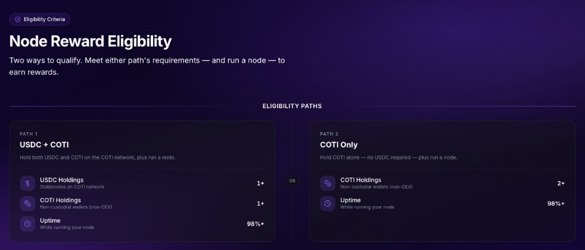<figcaption><p><strong>Node Reward Eligibility</strong>: two paths, numeric thresholds from the rewards contract, and an <strong>OR</strong> between paths.</p></figcaption></figure>

The page opens with an **Eligibility Criteria** pill, the title **Node Reward Eligibility**, and the subtitle *Two ways to qualify. Meet either path's requirements — and run a node — to earn rewards.*

Under **Eligibility Paths**, two cards sit on either side of a centered **OR** divider:

* **Path 1 — USDC + COTI** — *Hold both USDC and COTI on the COTI network, plus run a node.* Lists **USDC Holdings** (stablecoins on COTI network), **COTI Holdings** (non-custodial wallets; not CEX), and **Uptime** (while running your node). You must satisfy **all three** rows on this path for Path 1 to count.
* **Path 2 — COTI only** — *Hold COTI alone — no USDC required — plus run a node.* Lists **COTI Holdings** at the **solo** threshold (higher than Path 1’s COTI bar) and **Uptime**. Both must be met for Path 2 to count.

The exact numbers (for example `1+` / `2+` / `98%+`) are loaded from the on-chain eligibility rules and can differ by network or governance updates.

Below the cards, an info strip states that you can meet **either** path for rewards eligibility, that balances refresh about every **24 hours**, and includes a **Check My Eligibility** button: if the connected wallet already holds a node NFT, it routes to **My Node**; otherwise it opens a modal that summarizes status and can steer you to **`/setup`**.

Further down, **Important Notes** (*Things to Know*) expands on topics such as the two-path rule, that **COTI on centralized exchanges does not count**, continuous checks, and that node status is evaluated dynamically.

Authoritative rule logic is summarized under [Features → Eligibility checks](../features.md#4-eligibility-checks) and [Glossary → Eligibility](glossary.md#eligibility).
