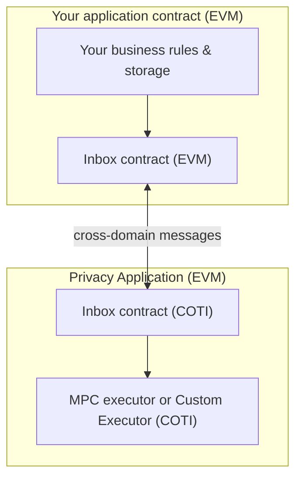

# Architecture and main components

## Vocabulary: PoD versus “Pod” in code

- **PoD** — **Privacy on Demand**, the **product pattern**: private work on COTI, orchestration on your EVM chain.
- **PodUser / PodLib** — **Solidity building blocks**. They help your **dApp contract** configure routing and call common private operations. They are **not** a separate blockchain; they are **libraries and base contracts** you inherit or use.

## High-level deployment view

Think of **three domains**:

1. **User device** — keys, encryption, decryption, UX.
2. **Your EVM chain** — your app’s contracts, assets, and the **Inbox** contract that speaks cross-domain.
3. **COTI execution** — private computation and the **MPC executor** contract your integration targets.

**Inbox** sits on **your chain** and is the **trusted bridge** between your contract logic and COTI. **MPC executor** sits on **COTI** and is the **entry point** for the SDK-configured private operation flow.

## Component diagram: your dApp contract’s perspective

The next diagram shows **logical modules** as engineers wire them. Exact inheritance names come from the SDK (for example `PodUserSepolia` on test networks).

### Inbox

- **What it is**: An on-chain **message router** and **callback** mechanism between domains.
- **Why it matters**: Without it, your EVM contract cannot **reach** COTI private execution or **receive** structured answers.
- **Analogy**: A **certified courier** between two offices: it does not replace either office, but **only** it can hand off the parcel and bring the signed reply back.

### MPC executor (COTI)

- **What it is**: The **COTI-side contract address** your dApp is configured to call for a given deployment. The SDK’s network presets expose this as a constant you set during construction (for example `MPC_EXECUTOR_ADDRESS` alongside `COTI_CHAIN_ID` in [Getting started](https://github.com/cotitech-io/coti-pod-sdk/blob/main/docs/04-getting-started.md)).
- **Why it matters**: It anchors **where** private execution is invoked in the COTI environment for **library-style** flows.

### PodUser

- **What it is**: A **configuration surface** for integrators: **which Inbox**, **which COTI chain**, **which executor**. Administrative changes are expected to be **access-controlled** (`onlyOwner` patterns in the SDK).
- **Why it matters**: Lets the same codebase target **different environments** (testnet vs mainnet, future routing updates) without rewriting core logic—**if** governance is handled responsibly.

### PodLib

- **What it is**: **High-level helpers** for **common private operations** (for example comparisons and arithmetic at fixed bit widths—see the SDK [features](https://github.com/cotitech-io/coti-pod-sdk/blob/main/docs/03-features.md) table).
- **Why it matters**: Faster path than writing a **custom** COTI contract for every operation. If you outgrow it, you move to **custom** encoding and COTI-side contracts using `MpcAbiCodec`, described in the SDK’s [Writing privacy contracts](https://github.com/cotitech-io/coti-pod-sdk/blob/main/docs/05-writing-privacy-contracts-on-ethereum.md).

## Data shapes: a non-developer mental model

Engineers talk about **`it*`**, **`gt*`**, and **`ct*`**. At a high level:

| Symbol (in docs) | Think of it as | Where it “lives” |
| --- | --- | --- |
| **`it*`** | **Signed, encrypted user input** bundled for submission | Built on the **client**, consumed by **your EVM contract** |
| **`gt*`** | **Private compute representation** during the operation | **Inside COTI** private execution |
| **`ct*`** | **Encrypted output** you can **store on your chain** and **decrypt client-side** | **Returned** to your contract, **read** by the user’s app |

A fuller table lives in the SDK’s [data types](https://github.com/cotitech-io/coti-pod-sdk/blob/main/docs/contracts/01-it-ct-gt-data-types.md) page.

## Trust and security highlights (for architects)

- **Callback authentication**: Your contract should only accept **Inbox-originated** callbacks for private results—otherwise anyone could try to spoof answers. The SDK’s `onlyInbox` pattern exists for this boundary ([features](https://github.com/cotitech-io/coti-pod-sdk/blob/main/docs/03-features.md)).
- **Request correlation**: Private work completes **later**; your system must track **request IDs** and statuses honestly in UX and backends ([Async private operations](async-private-operations.md)).
- **Key stewardship**: Client-side AES material is powerful; treat it like **credentials**, not analytics metadata ([TypeScript integration](https://github.com/cotitech-io/coti-pod-sdk/blob/main/docs/06-typescript-integration-ux-development.md)).

## Next steps

- [Glossary](glossary.md) — quick term lookup.
- [For developers: mapping concepts to the SDK](for-developers-mapping-to-the-sdk.md) — concrete doc links and checklists.
