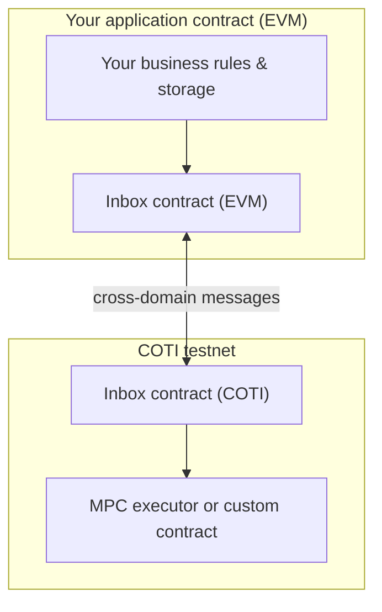

# Architecture and main components

## Vocabulary: PoD versus “Pod” in code

- **PoD** — **Privacy on Demand**, the **product pattern**: private work on COTI, orchestration on your EVM chain.
- **PodUser / PodLib** — **Solidity building blocks** in `@coti-io/coti-contracts`. They help your **dApp contract** configure routing and call common private operations. They are **not** a separate blockchain.

## Three repositories

| Package | What it ships |
| --- | --- |
| `@coti-io/coti-contracts` | `PodLib`, `PodUser*`, `IInbox` interface, `MpcAbiCodec`, examples, tokens |
| `@coti-io/coti-pod-inbox-contracts` | Inbox **implementation**, `InboxMiner`, `InboxFeeManager`, `PriceOracle` |
| `@coti/pod-sdk` | TypeScript client: encrypt/decrypt, fee-aware calls, request tracking |

The Inbox uses a **CREATE3 deterministic address** shared across Sepolia, COTI testnet, and Avalanche Fuji (`0xAb625bE229F603f6BBF964474AFf6d5487e364De` in [`PodNetworkConstants`](https://github.com/coti-io/coti-contracts/blob/main/contracts/pod/PodNetworkConstants.sol)).

## High-level deployment view

Think of **three domains**:

1. **User device** — keys, encryption, decryption, UX.
2. **Your EVM chain** — your app’s contracts, assets, and the **Inbox** contract.
3. **COTI execution** — private computation and the **MPC executor** (or custom COTI contract).

**Inbox** sits on **your chain** and is the **trusted bridge** between your contract logic and COTI. A matching Inbox on COTI receives cross-domain messages for the return leg.

## Component diagram

### Inbox

- **What it is**: On-chain **message router** and **callback** mechanism between domains.
- **Implementation**: [`coti-pod-inbox-contracts`](https://github.com/coti-io/coti-pod-inbox-contracts); interface in [`IInbox.sol`](https://github.com/coti-io/coti-contracts/blob/main/contracts/pod/IInbox.sol).
- **Why it matters**: Without it, your EVM contract cannot reach COTI private execution or receive structured answers.

### MPC executor (COTI)

- **What it is**: The COTI-side contract your dApp targets for **library-style** flows. Network presets such as [`PodUserSepolia`](https://github.com/coti-io/coti-contracts/blob/main/contracts/pod/mpc/PodUserSepolia.sol) call `configureCoti` in their constructor with the current executor address from `PodNetworkConstants`.
- **Why it matters**: Anchors where private execution is invoked on COTI.

### PodUser

- **What it is**: Configuration surface for **Inbox address**, **COTI chain id**, and **executor address**. Presets (`PodUserSepolia`, `PodUserFuji`) auto-wire testnet values; production changes should be **access-controlled** (`onlyOwner`).
- **Why it matters**: Same codebase can target different environments without rewriting core logic.

### PodLib

- **What it is**: High-level helpers for **common private operations** (arithmetic, comparison, bitwise ops at 64/128/256 bits). See [Reference: PodLib primitives](reference-podlib-and-primitives.md).
- **Why it matters**: Faster than a custom COTI contract for every operation. When you outgrow it, use `MpcAbiCodec` and custom COTI contracts ([Tutorial: custom privacy logic](tutorial-custom-logic.md)).

## Data shapes

| Symbol | Think of it as | Where it lives |
| --- | --- | --- |
| **`it*`** | Signed encrypted user input | Built on **client**, consumed by **EVM contract** |
| **`gt*`** | Private compute representation | **Inside COTI** execution |
| **`ct*`** | Encrypted output stored on-chain | **Returned** to your contract, **decrypted** client-side |

Full reference: [Reference: data types](reference-data-types.md).

## Trust and security highlights

- **Callback authentication**: Only accept **Inbox-originated** callbacks (`onlyInbox` from [`InboxUser.sol`](https://github.com/coti-io/coti-contracts/blob/main/contracts/pod/InboxUser.sol)).
- **Request correlation**: Track **request IDs** in UX and backends ([Async private operations](async-private-operations.md), [`PodRequest`](typescript-pod-sdk.md)).
- **Key stewardship**: Account AES keys are credentials ([Account onboarding](account-onboarding-aes-key.md)).

## Next steps

- **[Interactive PoD architecture (pod.coti.io)](https://pod.coti.io/)**
- [Glossary](glossary.md)
- [For developers: mapping concepts to the SDK](for-developers-mapping-to-the-sdk.md)
