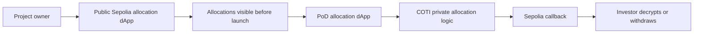
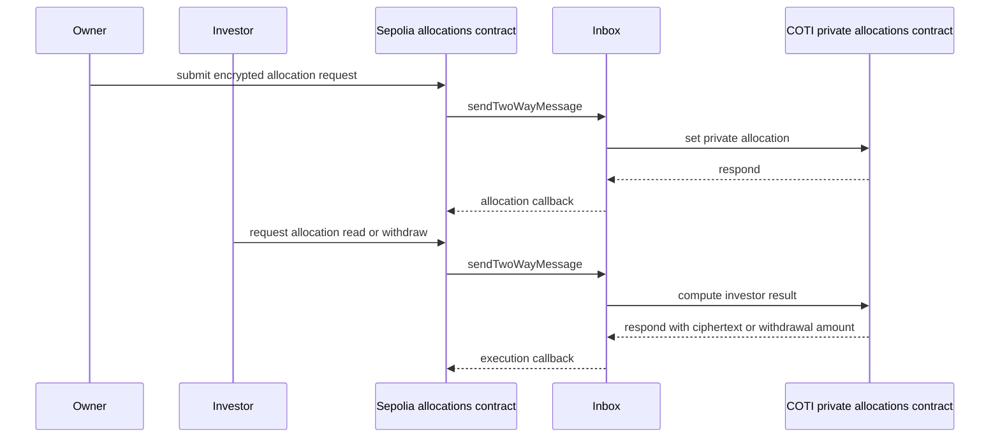

# Cookbook: private investor allocations with PoD

Many token launches include an allocation contract: the project records how many tokens each investor may claim, then opens withdrawals after launch. This cookbook starts from that familiar **public Sepolia dApp** pattern and turns it into a **Privacy on Demand (PoD)** dApp where investor allocation amounts stay private until they need to be revealed to the right party.

> **Note:** This is an educational cookbook. The allocation unlocks **100% after launch** so the PoD flow is easier to follow. Production vesting contracts usually need cliffs, partial releases, revocation rules, admin controls, and a broader test suite.

## What you will build

You will build the same product twice:

1. A public EVM version on Ethereum Sepolia.
2. A PoD version where allocation amounts are encrypted, processed privately on COTI, and returned to Sepolia through callbacks.



The public version is useful because it gives you a known baseline: owner assigns allocations, investors read their allocation, launch happens, withdrawals open, and investors claim tokens. The private version preserves the same user story, but changes how allocation data moves through the system.

## Parts in this cookbook

1. [Build the public Sepolia dApp](#part-1-build-the-public-sepolia-dapp)
2. [Script allocation and withdrawal](#part-2-script-allocation-and-withdrawal)
3. [Make allocations private with PoD](#part-3-make-allocations-private-with-pod)
4. [Async calls and request IDs](#part-4-async-calls-and-request-ids)
5. [Understand fees](#part-5-understand-fees)
6. [Encrypt and decrypt](#part-6-encrypt-and-decrypt)
7. [Allocate and read private allocations](#part-7-allocate-and-read-private-allocations)
8. [Withdraw with execution callback](#part-8-withdraw-with-execution-callback)
9. [Follow the lifecycle in explorers](#part-9-follow-the-lifecycle-in-explorers)

## Prerequisites

- A Solidity toolchain such as Hardhat or Foundry.
- A Sepolia wallet with test ETH for deploys, transactions, and PoD request fees.
- Node.js 18+ for scripts.
- The COTI contracts library: `npm install "@coti-io/coti-contracts"`.
- The TypeScript PoD SDK: `npm install "@coti/pod-sdk"`.
- The COTI client crypto package: `npm install "@coti-io/coti-sdk-typescript@^1.0.7"` (provides `decryptUint256({ ciphertextHigh, ciphertextLow }, key)` for the 256‑bit ciphertext shape).
- A way for users to complete PoD onboarding and obtain their account AES key for local decryption.

Before implementing the private version, read:

- [TypeScript PoD SDK (`CotiPodCrypto`, `PodContract`)](typescript-pod-sdk.md)
- [Async private operations](async-private-operations.md)
- [How do PoA fees work?](how-poa-fees-work.md)
- [Tutorial: custom privacy logic with PoD](tutorial-custom-logic.md)

## Part 1: Build the public Sepolia dApp

Start with the simple contract most Solidity developers already understand: an owner writes allocation amounts into a public mapping, then opens withdrawals after launch.

```solidity
// SPDX-License-Identifier: MIT
pragma solidity ^0.8.26;

import "@openzeppelin/contracts/access/Ownable.sol";
import "@openzeppelin/contracts/token/ERC20/IERC20.sol";
import "@openzeppelin/contracts/token/ERC20/utils/SafeERC20.sol";

contract Allocations is Ownable {
    using SafeERC20 for IERC20;

    mapping(address => uint256) public allocations;
    bool public withdrawOpen;
    IERC20 public immutable token;

    event AllocationSet(address indexed investor, uint256 amount);
    event WithdrawalsOpened();
    event Withdrawn(address indexed investor, uint256 amount);

    constructor(IERC20 _token, address initialOwner) Ownable(initialOwner) {
        token = _token;
    }

    function openWithdrawals() external onlyOwner {
        withdrawOpen = true;
        emit WithdrawalsOpened();
    }

    function setAllocation(address investor, uint256 amount) external onlyOwner {
        allocations[investor] = amount;
        emit AllocationSet(investor, amount);
    }

    function withdraw() external {
        require(withdrawOpen, "withdrawals closed");

        uint256 amount = allocations[msg.sender];
        require(amount > 0, "no allocation");

        allocations[msg.sender] = 0;
        token.safeTransfer(msg.sender, amount);

        emit Withdrawn(msg.sender, amount);
    }
}
```

This is intentionally small, but it already includes habits you should keep in production examples:

- `withdrawOpen` is checked before transfers.
- Allocation is cleared before `safeTransfer`, so an investor cannot withdraw twice.
- `onlyOwner` protects allocation writes and launch control.
- Events give scripts and indexers a stable way to follow state changes.

> **Warning:** Do not ship this as a production vesting contract. Real investor flows need schedules, token decimal handling, funding checks, emergency behavior, accounting around partial claims, and tests for every state transition.

## Part 2: Script allocation and withdrawal

The owner script deploys the token and allocation contract, funds the allocation contract, and writes investor balances.

```typescript
import { ethers } from "ethers";

const allocationsAbi = [
  "function setAllocation(address investor,uint256 amount)",
  "function openWithdrawals()",
  "function allocations(address investor) view returns (uint256)",
] as const;

const allocations = new ethers.Contract(allocationsAddress, allocationsAbi, owner);

await (await token.transfer(allocationsAddress, ethers.parseUnits("1000000", 18))).wait();
await (await allocations.setAllocation(investorA, ethers.parseUnits("1000", 18))).wait();
await (await allocations.setAllocation(investorB, ethers.parseUnits("2500", 18))).wait();

console.log("investor A:", await allocations.allocations(investorA));
console.log("investor B:", await allocations.allocations(investorB));
```

The investor script can read and withdraw without asking the project for any off-chain data.

```typescript
const investorAllocations = allocations.connect(investor);

const amount = await investorAllocations.allocations(await investor.getAddress());
console.log("public allocation:", amount.toString());

await (await allocations.openWithdrawals()).wait(); // owner action in a real script
await (await investorAllocations.withdraw()).wait();
```

That simplicity is also the privacy problem. A public mapping exposes every allocation amount to anyone who knows or guesses investor addresses. Even if the UI hides the numbers, archive nodes, explorers, logs, and direct RPC calls do not.

## Part 3: Make allocations private with PoD

Private allocations are a better fit for the **custom PoD dApp** model than the primitive-only model. The app needs private state and business logic, not just one arithmetic operation.

Split the system into two contracts:

| Layer | Responsibility |
| --- | --- |
| **Sepolia** | Holds public ERC-20 tokens, receives user transactions, checks public launch / withdrawal-open state, pays Inbox fees, tracks request state, and transfers tokens after authorized callbacks. |
| **COTI** | Stores or derives encrypted allocation amounts, checks private allocation / claimed state, off-boards ciphertext to the investor, and responds to Sepolia. |

The high-level flow becomes:



On Sepolia, the contract should be thin, but it still owns public business rules. It should check whether withdrawals are open before dispatching a withdraw request, submit requests, correlate callbacks by request ID, and transfer public tokens only after the COTI-side result says the investor may claim. It should not try to inspect private allocation amounts.

On COTI, the contract owns the private allocation logic. Structurally, it follows the same pattern as the custom logic tutorial: the COTI contract receives Inbox calls, runs private computation, and calls `inbox.respond(...)` with an ABI-encoded result that the Sepolia callback can decode.

### Set trust relationships

A custom PoD app has contracts on both sides of the Inbox. Do not accept callbacks from any remote contract that happens to return correctly shaped bytes. Configure the expected COTI peer on Sepolia, configure the expected Sepolia peer on COTI where your COTI-side contract needs to authenticate inbound messages, and verify those peers in the callback path.

On the Sepolia side, store the trusted COTI contract address at deployment or through an owner-only setup function:

```solidity
address public cotiAllocationPeer;

event CotiAllocationPeerSet(address indexed peer);

function setCotiAllocationPeer(address peer) external onlyOwner {
    require(peer != address(0), "zero peer");
    cotiAllocationPeer = peer;
    emit CotiAllocationPeerSet(peer);
}
```

On the COTI side, store the trusted Sepolia contract as well. The exact base contract and constants depend on the SDK version you install, but the rule is the same: only process messages that came through the Inbox from your expected host-chain contract.

```solidity
address public sepoliaAllocationPeer;

function setSepoliaAllocationPeer(address peer) external onlyOwner {
    require(peer != address(0), "zero peer");
    sepoliaAllocationPeer = peer;
}

function _requireTrustedSepoliaPeer() internal view {
    (uint256 callerChain, address callerContract) = inbox.inboxMsgSender();
    require(callerChain == SEPOLIA_CHAIN_ID, "wrong source chain");
    require(callerContract == sepoliaAllocationPeer, "wrong source contract");
}

function receiveSetAllocation(bytes memory data) external onlyInbox {
    _requireTrustedSepoliaPeer();

    // Update private allocation state.
}
```

When sending a request, route it to that exact peer:

```solidity
requestId = IInbox(inbox).sendTwoWayMessage{value: msg.value}(
    COTI_TESTNET_CHAIN_ID,
    cotiAllocationPeer,
    methodCall,
    this.onSetAllocationCompleted.selector,
    this.onDefaultMpcError.selector,
    callbackFeeLocalWei
);
```

When the Inbox calls your Sepolia callback, verify both layers of trust:

1. `onlyInbox` proves the immediate caller is the local Inbox.
2. `inboxMsgSender()` proves which remote chain and remote contract produced the message.

```solidity
function _requireTrustedCotiPeer() internal view {
    (uint256 callerChain, address callerContract) = IInbox(inbox).inboxMsgSender();
    require(callerChain == COTI_TESTNET_CHAIN_ID, "wrong source chain");
    require(callerContract == cotiAllocationPeer, "wrong source contract");
}

function onSetAllocationCompleted(bytes memory resultData) external onlyInbox {
    _requireTrustedCotiPeer();

    bytes32 requestId = IInbox(inbox).inboxSourceRequestId();
    address investor = abi.decode(resultData, (address));

    allocationRequests[requestId] = AllocationRequest({
        investor: investor,
        status: RequestStatus.Completed
    });

    emit PrivateAllocationCompleted(requestId, investor);
}
```

Apply the same check to every Sepolia callback: allocation writes, allocation reads, withdraw approvals, and error handlers that change state.

## Part 4: Async calls and request IDs

PoD calls are asynchronous. You are already familiar with async callbacks in Javascript. Consider your async calls in solidity as jobs:

1. The user or owner submits a Sepolia transaction.
2. The Sepolia contract sends a two-way Inbox message and emits a `requestId`.
3. COTI executes the private operation.
4. The Inbox invokes the Sepolia callback in a later transaction.
5. The app marks the request as completed or failed.

Your Sepolia contract does **not** run the private computation or synchronously receive the answer. Its job is to **start** the PoD request and provide callback functions that the Inbox can call later. This is similar to the JavaScript async callback pattern: you submit work now, keep a handle you can use for correlation, and let a callback update your application state when the result is ready.

As a reminder, this is how a javascript callback is defined:

```typescript
startPrivateAllocationJob(input, (result) => {
  // This runs later, after the private work completes.
  storeResult(result);
});
```

In PoD, the equivalent of `startPrivateAllocationJob` is the Sepolia transaction that calls the Inbox, and the equivalent of the JavaScript callback is your Solidity callback selector, such as `onSetAllocationCompleted` or `onAllocationRead`.

```solidity
enum RequestStatus {
    None,
    Pending,
    Completed,
    Failed
}

struct AllocationRequest {
    address investor;
    RequestStatus status;
}

mapping(bytes32 => AllocationRequest) public allocationRequests;

event PrivateAllocationRequested(bytes32 indexed requestId, address indexed investor);
event PrivateAllocationCompleted(bytes32 indexed requestId, address indexed investor);
```

When the request is sent, store just enough correlation data for the later callback:

```solidity
requestId = IInbox(inbox).sendTwoWayMessage{value: msg.value}(
    COTI_TESTNET_CHAIN_ID,
    cotiAllocationPeer,
    methodCall,
    this.onSetAllocationCompleted.selector,
    this.onDefaultMpcError.selector,
    callbackFeeLocalWei
);

allocationRequests[requestId] = AllocationRequest({
    investor: investor,
    status: RequestStatus.Pending
});
```

When the Inbox calls back, verify the Inbox and the remote peer, then update state for that request:

```solidity
function onSetAllocationCompleted(bytes memory resultData) external onlyInbox {
    (uint256 callerChain, address callerContract) = IInbox(inbox).inboxMsgSender();
    require(callerChain == COTI_TESTNET_CHAIN_ID && callerContract == cotiAllocationPeer, "not allowed");

    bytes32 requestId = IInbox(inbox).inboxSourceRequestId();
    address investor = abi.decode(resultData, (address));

    allocationRequests[requestId] = AllocationRequest({
        investor: investor,
        status: RequestStatus.Completed
    });

    emit PrivateAllocationCompleted(requestId, investor);
}
```

In TypeScript, use `PodContract.extractRequestIds(txHash)` after the transaction is mined. This reads Inbox `MessageSent` logs and gives your UI or script the request ID to poll.

```typescript
const txResponse = await pod.encryptAndCallMethod("setPrivateAllocation", args, feeCfg);
const receipt = await txResponse.wait();

const requestIds = receipt?.hash ? await pod.extractRequestIds(receipt.hash) : [];
const requestId = requestIds[0];
```

Until the callback lands, show `Pending`. Do not expect encrypted outputs, claimability, or token transfers to be visible in the same transaction that submitted the request.

## Part 5: Understand fees

Every two-way PoD message needs enough native token for both legs:

- The forward leg from Sepolia to COTI.
- The return leg from COTI back to Sepolia.

The callback leg is represented by `callbackFeeLocalWei`. If it is underfunded, the private operation may complete but the callback may not update Sepolia state. That usually looks like a request stuck in `Pending`.

```typescript
import {
  DataType,
  PodContract,
  type PodFeeEstimationConfig,
  type PodMethodArgument,
} from "@coti/pod-sdk";

const args: PodMethodArgument[] = [
  { type: DataType.Address, value: investorAddress, isCallBackFee: false },
  { type: DataType.itUint256, value: allocationAmount, isCallBackFee: false },
  { type: DataType.Uint256, value: "0", isCallBackFee: true },
];

const feeCfg: PodFeeEstimationConfig = {
  forwardGasLimit: 500_000n,
  gasPrice: (await signer.provider!.getFeeData()).gasPrice ?? 0n,
  callBackGasLimit: 300_000n,
  callBackDataSize: 512n,
};

const estimated = await pod.estimateFee("setPrivateAllocation", args, feeCfg);
console.log("total fee:", estimated.totalFee.toString());
console.log("callback fee:", estimated.callBackFee.toString());
```

Tune `forwardGasLimit`, `callBackGasLimit`, and `callBackDataSize` from real measurements. For the full model, see [How do PoA fees work?](how-poa-fees-work.md).

## Part 6: Encrypt and decrypt

The project owner encrypts allocation amounts before submitting them to the private flow.

```typescript
import { CotiPodCrypto, DataType } from "@coti/pod-sdk";

const encryptedAllocation = await CotiPodCrypto.encrypt(
  ethers.parseUnits("1000", 18).toString(),
  "testnet",
  DataType.itUint256
);
```

If you use `PodContract.encryptAndCallMethod`, you can pass the plaintext string plus `DataType.itUint256`; the SDK encrypts and encodes the argument before sending the transaction. If the browser or backend already encrypted the value, use `callMethod` with the ciphertext JSON.

Investors decrypt only the ciphertext that was off-boarded to them. Because `ctUint256` is a struct, the contract read returns a tuple `{ ciphertextHigh, ciphertextLow }`:

```typescript
const raw = await sepoliaAllocations.readResultByRequest(requestId);
const ct = {
  ciphertextHigh: BigInt(raw.ciphertextHigh ?? raw[0]),
  ciphertextLow:  BigInt(raw.ciphertextLow  ?? raw[1]),
};

const plain = CotiPodCrypto.decrypt(
  ct,
  accountAesKeyFromOnboarding,
  DataType.Uint256
);

console.log("private allocation:", plain);
```

Under the hood, the 256‑bit decrypt path calls `decryptUint256({ ciphertextHigh, ciphertextLow }, key)` from `@coti-io/coti-sdk-typescript` (`^1.0.7`). Narrower lanes (`Uint64`, `Uint128`) still take a single ciphertext word.

> **Warning:** Never log, persist, or transmit the account AES key as ordinary application data. Treat it as user-controlled key material.

## Part 7: Allocate and read private allocations

The owner-facing operation stores an investor allocation privately.

Conceptually, the Sepolia function looks like this:

```solidity
function setPrivateAllocation(
    address investor,
    itUint256 calldata encryptedAmount,
    uint256 callbackFeeLocalWei
) external payable onlyOwner returns (bytes32 requestId) {
    // Build an Inbox method call to the COTI-side allocation contract.
    // Follow MpcAbiCodec argument construction from your installed @coti-io/coti-contracts version.

    requestId = IInbox(inbox).sendTwoWayMessage{value: msg.value}(
        COTI_TESTNET_CHAIN_ID,
        cotiAllocationPeer,
        methodCall,
        this.onSetAllocationCompleted.selector,
        this.onDefaultMpcError.selector,
        callbackFeeLocalWei
    );

    allocationRequests[requestId] = AllocationRequest({
        investor: investor,
        status: RequestStatus.Pending
    });

    emit PrivateAllocationRequested(requestId, investor);
}
```

The callback does not reveal the amount. It only confirms that private state was updated.

```solidity
function onSetAllocationCompleted(bytes memory resultData) external onlyInbox {
    (uint256 callerChain, address callerContract) = IInbox(inbox).inboxMsgSender();
    require(callerChain == COTI_TESTNET_CHAIN_ID && callerContract == cotiAllocationPeer, "not allowed");

    bytes32 requestId = IInbox(inbox).inboxSourceRequestId();
    address investor = abi.decode(resultData, (address));

    allocationRequests[requestId] = AllocationRequest({
        investor: investor,
        status: RequestStatus.Completed
    });

    emit PrivateAllocationCompleted(requestId, investor);
}
```

For investor reads, the investor asks COTI to off-board their allocation to their address. The callback stores `ctUint256`, and the investor decrypts locally with their account AES key.

`ctUint256` is a Solidity **struct** with two `ctUint128` limbs (`ciphertextHigh`, `ciphertextLow`), so the decoded local needs a `memory` location and the storage mapping holds the two‑limb tuple.

```solidity
mapping(bytes32 => ctUint256) public allocationReadResults;

function onAllocationRead(bytes memory resultData) external onlyInbox {
    (uint256 callerChain, address callerContract) = IInbox(inbox).inboxMsgSender();
    require(callerChain == COTI_TESTNET_CHAIN_ID && callerContract == cotiAllocationPeer, "not allowed");

    bytes32 requestId = IInbox(inbox).inboxSourceRequestId();
    ctUint256 memory allocation = abi.decode(resultData, (ctUint256));

    allocationReadResults[requestId] = allocation;
}
```

## Part 8: Withdraw with execution callback

Withdrawal is where public and private state meet. The investor submits a withdraw request on Sepolia. Sepolia checks the public `withdrawOpen` state before sending the PoD request. COTI checks the private allocation and private claimed state, then the callback returns the public transfer amount to Sepolia.

The request entrypoint should keep the public launch check local:

```solidity
function withdraw(uint256 callbackFeeLocalWei) external payable returns (bytes32 requestId) {
    require(withdrawOpen, "withdrawals closed");

    // Build an Inbox method call that asks the trusted COTI peer to approve
    // msg.sender's private allocation withdrawal.

    requestId = IInbox(inbox).sendTwoWayMessage{value: msg.value}(
        COTI_TESTNET_CHAIN_ID,
        cotiAllocationPeer,
        methodCall,
        this.onWithdrawApproved.selector,
        this.onDefaultMpcError.selector,
        callbackFeeLocalWei
    );

    emit WithdrawRequested(requestId, msg.sender);
}
```

On Sepolia, keep the token transfer in the authorized callback:

```solidity
mapping(address => bool) public claimed;

function onWithdrawApproved(bytes memory resultData) external onlyInbox {
    _requireTrustedCotiPeer();

    bytes32 requestId = IInbox(inbox).inboxSourceRequestId();
    (address investor, uint256 amount) = abi.decode(resultData, (address, uint256));

    require(!claimed[investor], "already claimed");
    claimed[investor] = true;

    token.safeTransfer(investor, amount);

    emit WithdrawApproved(requestId, investor, amount);
}
```

The exact COTI-side contract depends on the SDK version and how you model private state. The important invariant is that Sepolia transfers tokens only from a callback that:

- Is protected by `onlyInbox`.
- Verifies `inboxMsgSender()` against the expected COTI chain and contract.
- Decodes the expected result shape.
- Marks the investor claimed before transferring tokens.

This preserves the public contract’s safety habits while moving sensitive allocation logic into PoD.

## Part 9: Follow the lifecycle in explorers

When debugging a PoD allocation request, follow the same object through every step:

| Step | Where to look | What to capture |
| --- | --- | --- |
| Request transaction | Sepolia explorer | User transaction hash and app event. |
| Inbox send | Sepolia logs | `MessageSent` and the `requestId` extracted by `PodContract.extractRequestIds`. |
| COTI execution | COTI explorer / operator logs | Remote contract call and private execution status. |
| Callback transaction | Sepolia explorer | Inbox callback transaction into your app contract. |
| App completion | Sepolia logs / UI indexer | `Completed`, `Failed`, `WithdrawApproved`, or equivalent app event. |

For COTI network details and explorer links, start with the [COTI testnet page](../networks/testnet/README.md). For the end-to-end mental model, see [How a private request travels end to end](how-a-private-request-travels-end-to-end.md).

## What to harden for production

Before adapting this cookbook for a real launch, add:

- A real vesting schedule: launch time, cliffs, partial claims, and released-but-unclaimed accounting.
- Strong request ownership: each request ID should map to the expected investor and operation.
- Replay protection and idempotent callbacks.
- Funding checks so the Sepolia contract can satisfy approved withdrawals.
- Clear failure states and support tooling for stuck requests.
- Tests for unauthorized callbacks, wrong remote peers, underfunded fees, duplicate withdrawals, malformed callback data, and token transfer failures.
- Indexer support so users can see pending, completed, and failed private actions without manually inspecting logs.

## Reference links

- [Tutorials: building PoD dApps](tutorials-privacy-on-demand.md)
- [Tutorial: private Adder on Sepolia](tutorial-private-adder-sepolia.md)
- [Tutorial: custom privacy logic with PoD](tutorial-custom-logic.md)
- [TypeScript PoD SDK (`CotiPodCrypto`, `PodContract`)](typescript-pod-sdk.md)
- [PoD SDK documentation](https://github.com/cotitech-io/coti-pod-sdk/tree/main/docs)
