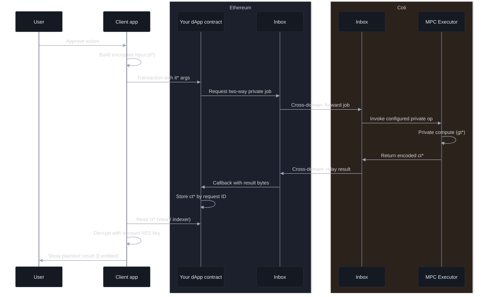

# How a private request travels end to end

This page describes **one full cycle** of Privacy on Demand **without assuming Solidity knowledge**. Names match what you will see in the [PoD SDK documentation](https://github.com/cotitech-io/coti-pod-sdk/tree/main/docs).

## Cast of roles

| Role | Plain description |
| --- | --- |
| **End user** | A person (or agent) using a wallet or app. They approve transactions and hold decryption capability for their own results. |
| **Client app** | Browser, mobile app, or script that prepares **encrypted inputs** and later **decrypts outputs** locally. |
| **Your dApp contract** | Smart contract on **your EVM chain** that encodes business rules and stores **correlation IDs** and **encrypted results** (`ct*` types in developer docs). |
| **Inbox (EVM)** | On-chain **messaging hub** on **your chain** that **forwards** jobs to the **Inbox (COTI)** and **calls back** into your contract when the answer is ready. |
| **Inbox (COTI)** | The **COTI-side Inbox contract**—the **counterpart** to the host Inbox. It receives cross-domain messages and routes work to the MPC Executor. |
| **COTI private execution** | The environment that performs **private computation** on **compute-domain values** (`gt*` in developer docs). |
| **MPC Executor** | The **COTI-side contract** your integration targets for a given network (see SDK presets such as `PodUserSepolia` in [Getting started](https://github.com/cotitech-io/coti-pod-sdk/blob/main/docs/04-getting-started.md)). The **Inbox (COTI)** invokes it; it is **not** the same contract as either Inbox. |

## The journey in seven steps

1. **User chooses an action** (for example “compare two private numbers”, “run a private scoring step”, and so on).
2. **Client encrypts inputs** into **`it*` payloads**: ciphertext plus the cryptographic material the protocol expects (signatures). The plaintext never has to hit the chain in the clear.
3. **User submits an EVM transaction** to your dApp contract, which validates public rules (permissions, payment, scheduling).
4. **Your contract asks the Inbox (EVM)** to send a **two-way message**: outbound leg to **Inbox (COTI)**, inbound **callback** to your contract when finished. This step is **not** the same as a normal internal function return—see [Async private operations](async-private-operations.md).
5. **Inbox (COTI)** hands the job to the **MPC Executor**, which runs the private logic on **`gt*` values**—the internal representation used during computation.
6. **The MPC Executor returns through Inbox (COTI) and Inbox (EVM)**, delivering an **ABI-encoded payload** of **`ct*` ciphertext**: encrypted outputs suitable to store on your chain.
7. **Your contract records the result** keyed by a **request ID**. The **user reads ciphertext from chain or API**, then **decrypts locally** with their **account AES key** (after proper onboarding).

## Sequence diagram (conceptual)

**Colors:** the **cool charcoal** panel is **contracts on your host chain (Ethereum)**—**Your dApp contract** and **Inbox (EVM)**. The **warm charcoal** panel is **contracts on COTI**—**Inbox (COTI)** and **MPC Executor**. **User** and **Client app** are off-chain (default styling). Arrows **between** the two dark panels are **cross-chain / cross-domain** handoffs. The diagram uses a **dark theme** so labels stay light-on-dark and readable.

**Mermaid quirk:** on a `box` line, do not put **ASCII** parentheses in the title after `rgb(r, g, b)` (for example `(COTI)`). The parser treats everything from `rgb(` through the **last** `)` on that line as the color string, which breaks the fill. Use an em dash in the box title instead—`(Ethereum)` / `(COTI)` still appear on participant labels below.

## Fees and gas

Private jobs that cross from your chain to COTI and back incur **network and execution costs**. Integrations typically attach **native token value** on the request and split it between **remote execution** and the **callback** leg. Operators configure **fee parameters** and **oracle** behavior on supporting contracts (see the SDK’s [Fees, gas, and oracle](https://github.com/cotitech-io/coti-pod-sdk/blob/main/docs/contracts/04-fees-gas-and-oracle.md) page).

## Next steps

- [Architecture and main components](architecture-and-components.md) — how **PodUser**, **PodLib**, and the **Inbox** relate in a component picture.
- [Async private operations](async-private-operations.md) — why the UI must show **pending** states.
