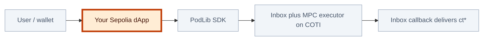

# Tutorials: building Privacy on Demand (PoD) dApps

PoD applications fall into **two integration models**. Choosing the right one early saves rework: most simple flows stay entirely on your **host EVM chain** using shipped primitives; richer private logic needs a **custom COTI-side contract** and a thin **Sepolia (or other host) contract** that only orchestrates encrypted I/O.

## 1. Primitive-only dApps (MpcLib / PodLib)

COTI ships a large set of **primitive MPC operations**. For many dApps, composing a few of these is enough: you never author Solidity on COTI, and the **MPC executor** on the COTI network already knows how to run each primitive.

In the **PoD Solidity SDK**, these primitives are exposed as helpers on **`PodLib`** (and width-specific variants such as **`PodLib64`**, **`PodLib128`**, **`PodLib256`**). The upstream documentation often refers to this layer as the **MPC library**; method names mirror the underlying primitives (for example **`add`**, **`mul`**, …) for each supported width.

If your business logic **only** needs these operations, and only **once or twice** per user action (or in a similarly small composition), you can usually implement the whole flow from your **host-chain contract** by calling **`PodLib`** helpers, which package the Inbox round-trip to the executor.

### Available primitive families (per width)

For **64-, 128-, and 256-bit** lanes, the library surface includes (names may be width-suffixed in Solidity, for example `add64` / `add128` / `add256`):

**Arithmetic and bitwise:** `add`, `mul`, `div`, `rem`, `and`, `or`, `xor`  

**Min / max:** `min`, `max`  

**Comparisons:** `eq`, `ne`, `ge`, `le`, `lt`  

**Control:** `mux`  

**Shifts:** `shl`, `shr`  

**Randomness:** `randBoundedBits`  

For the authoritative list, signatures, and gas notes, use the SDK’s **[MPC library (PodLib)](https://github.com/cotitech-io/coti-pod-sdk/blob/main/docs/05b-multi-party-computing-library-mpclib.md)** and **[PodLib.sol](https://github.com/cotitech-io/coti-pod-sdk/blob/main/contracts/mpc/PodLib.sol)** in your installed `@coti/pod-sdk` version.

### Example tutorial (simple PoD dApp)

Same topic as the **blue callout at the top of this page**: one primitive (`add`), **`msg.value`** / **`callbackFeeLocalWei`**, encrypted sum stored on the host chain. Follow the link below for the full walkthrough.

<a href="tutorial-private-adder-sepolia.md" style="color:#1e3a8a; text-decoration:none;">Tutorial: private Adder on Sepolia</a>

### TypeScript SDK guide

TypeScript usage is documented on a dedicated page so this overview stays short:

- [TypeScript PoD SDK (`CotiPodCrypto`, `PodContract`)](typescript-pod-sdk.md) — encryption/decryption, `estimateFee`, `encryptAndCallMethod`, `callMethod`, and `extractRequestIds`.

---

## 2. Custom PoD dApps (host chain + COTI contracts)

When your logic **goes beyond** what the primitives cover, or you need **non-trivial composition**, **custom types**, or **stateful private processing** on ciphertext, you design a **custom PoD dApp** with **two contracts**:

| Layer | Role |
| --- | --- |
| **Host EVM (e.g. Sepolia)** | **Client-facing orchestration**: accept encrypted user inputs (`it*`), forward work to COTI via the Inbox, receive encrypted outputs (`ct*`) in callbacks. It does **not** hold or meaningfully process **intermediate garbled / MPC-internal state** (`gt*`) the way the COTI execution environment can. |
| **COTI** | **Private compute and private state**: run garbled-circuit logic, store or transform encrypted data off the host chain’s MPC limitations, and return selectively **user-bound** ciphertext (for example via `MpcCore.offBoardToUser`) or other encoded results. |

Typical **Sepolia** flow in this model:

1. Obtain **encrypted user data** on the client and pass it to your host-chain contract.
2. Send a **two-way Inbox** message that invokes a **method on your deployed COTI-side contract** (built with `MpcAbiCodec` and the patterns in the SDK’s “custom mode” docs).
3. The COTI contract runs the private logic and calls **`inbox.respond`** with an ABI-encoded payload your Sepolia callback understands.
4. The host chain stores or forwards **encrypted** results (`ct*`) for the user or for follow-up calls.

### Example tutorial (custom logic, Solidity excerpts)

**Encrypted messaging** sketch: a **Sepolia** `PodUserSepolia` contract dispatches calls, and a **COTI-side** `DirectMessageCotiSide` contract uses `MpcCore.offBoardToUser` so only the recipient receives a decryptable ciphertext. That page focuses on the **split responsibility** between chains and on **verifying `inboxMsgSender()`** in callbacks. Follow the link below for the Solidity walkthrough.

<a href="tutorial-custom-logic.md" style="color:#9a3412; text-decoration:none;">Tutorial: custom privacy logic with PoD</a>

---

## How the two models differ (diagram)

At a high level, the **adder** stays on **primitives + executor**; **custom messaging** adds a **first-class COTI contract** you maintain.

On GitHub and other narrow layouts, one tall diagram with stacked subgraphs is often **compressed**. The same model is easier to read as **two left-to-right flows** (scroll horizontally if needed).

### Path 1 — Primitives only (e.g. private adder)

The callback runs **in the same Sepolia contract** you deployed (`SA`); there is no separate COTI Solidity dApp in this path.

### Path 2 — Custom COTI logic (e.g. encrypted messaging)

`inbox.respond` and the rest of your private logic run **inside** `DC` before the return message is delivered to the callback on Sepolia.

**Legend:** **Amber / thick orange border** — Solidity **you** write and deploy (**one** host-chain contract in Path 1; **host + COTI** contracts in Path 2). **Gray** — wallets, SDK helpers you import, and COTI network infrastructure you do not author as application code.

**Intuition:** in Path 1, **COTI-side custom code is optional**—the executor already implements **`add`** (and the other primitives). In Path 2, **`DirectMessageCotiSide`** (or your own contract) **is** the program: the executor runs *your* compiled private contract logic, not only a single named primitive.

---

## Where to read next

| Your situation | Start here |
| --- | --- |
| Logic fits the primitive list and a small number of MPC steps | [Tutorial: private Adder on Sepolia](tutorial-private-adder-sepolia.md), [TypeScript PoD SDK (`CotiPodCrypto`, `PodContract`)](typescript-pod-sdk.md), then [MPC library (PodLib) — SDK](https://github.com/cotitech-io/coti-pod-sdk/blob/main/docs/05b-multi-party-computing-library-mpclib.md) |
| Logic needs custom COTI processing, `gt*` handling, or richer state | [Tutorial: custom privacy logic with PoD](tutorial-custom-logic.md), then [Writing privacy contracts on Ethereum — SDK](https://github.com/cotitech-io/coti-pod-sdk/blob/main/docs/05-writing-privacy-contracts-on-ethereum.md) and [Request builder and remote calls — SDK](https://github.com/cotitech-io/coti-pod-sdk/blob/main/docs/contracts/03-request-builder-and-remote-calls.md) |
| Fees, async UX, and components | [How do PoA fees work?](how-poa-fees-work.md), [Async private operations](async-private-operations.md), [Architecture and main components](architecture-and-components.md) |

Return to the [Privacy on Demand section index](README.md).
